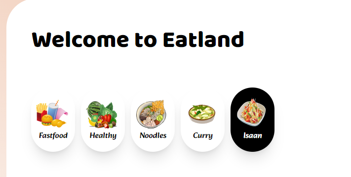
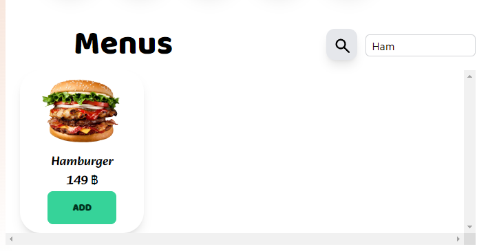
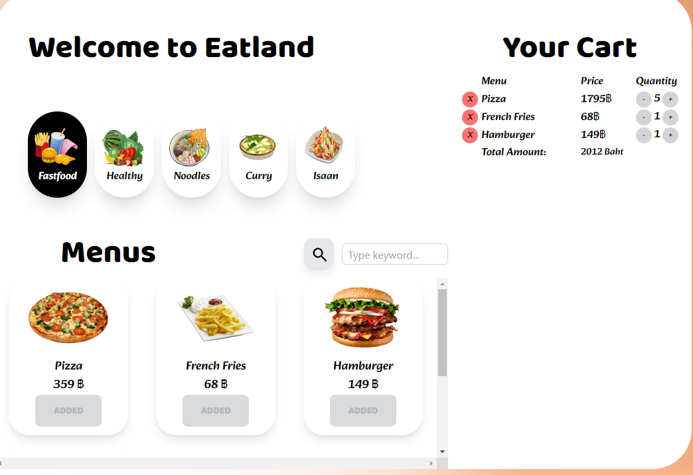
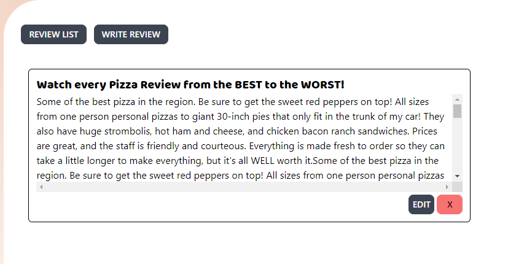
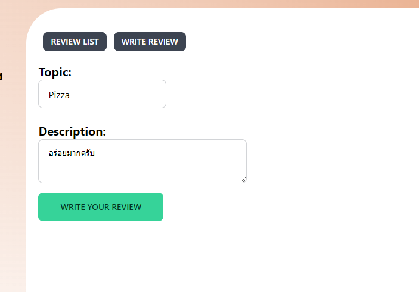
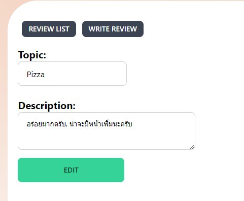
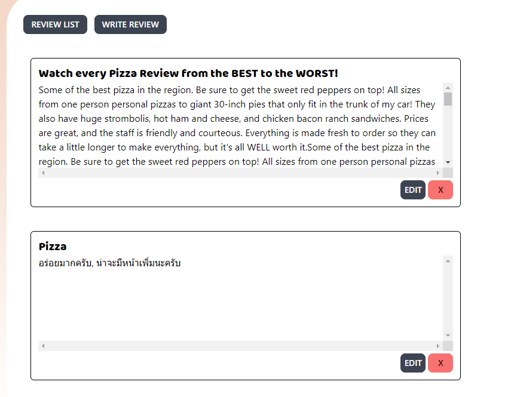
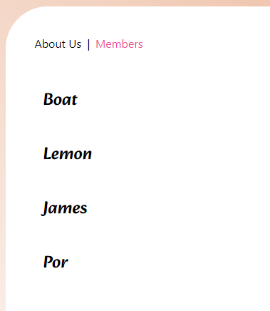
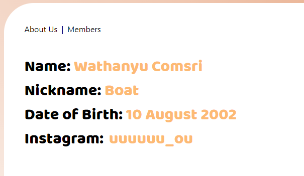

# Client Side Technology Project - Food Ordering Interface
A single-page web application that displays information about numerous food that you can order.

## Software development environment

> Front-end (Parts of Users Interaction)
- Create the user interface using `Vue.js` (Organize document structure, display format, and many functionalities as necessary to be in accordance with requirements) and use `TailwindCSS` to adorn the user interface.

 

 

> Back-end (Parts of Resource Provider) & Database (Parts of Stored Data)
- Utilize `JSON-Server`, which operates on the front-end itself to serve as a "Resource Provider", to send requests in the form of REST APIs to the specified APIs and JSON Server ports in order to retrieve the static data that APIs have saved. It functions as a database and back-end in one.

 

 

> DevOps (Parts of Deployment)
- :x: In testing, the software is tested on a `local host` and is not deployed to a server, making it unsupported for public access.
 

> Project Management Part
- Use `Discord` to collaborate, review code, and track project progress.
- Shared Code via `GitHub`.

   
   

 

## User interface & Features

1. ฟีเจอร์การเลือกแสดงข้อมูลรายการอาการตามประเภท : ข้อมูลรายการอาหารที่แสดงจะแสดงตามประเภทอาหารที่เลือก

2. สามารถพิมพ์ค้นหาอาหารตามชื่อของมันได้ โดยจะมีการ trim whitespace ต่างๆออก และ จะแสดงรายการอาหารที่ภายในชื่อของมัน ประกอบไปด้วย `keyword` ที่ผู้ใช้พิมพ์เข้าไป
* `Response-to-UserInput` : รายการอาหารที่แสดงเปลี่ยนไปเรื่อยๆ ตอบสนองกับ `keyword` ที่ผู้ใช้กรอกได้ทันที จากการใช้งาน `computed function`

3. สามารถเพิ่มรายการอาหารเข้าสู่ตะกร้าได้ โดยกดที่ปุ่ม `ADD` บริเวณด้านล่างของรูปประกอบรายการอาหาร
* `Add-to-Cart` : รายการอาหารก็จะถูกแสดงขึ้นมาที่แถบ Your Cart ที่คอลัมน์ด้านขวา โดยเมื่อกดปุ่ม `ADD` แล้ว จะเปลี่ยนสถานะของรายการอาหารนั้นๆ เป็น `ADDED` และไม่สามารถกด ADD รายการนั้นเพิ่มได้ ( ต้องไปแก้ไขที่เมนู Your Cart )
* `Manage-items` in Cart : ที่บริเวณแถบ Your Cart ด้านขวา สามารถกดเพิ่ม-ลดจำนวนอาหารที่ต้องการสั่งซื้อได้ และสามารถกดลบรายการอาหารที่อยู่ในตะกร้าได้ โดยกดที่ :x:
* `Total-Amount` : คำนวณค่าใช้จ่ายทั้งหมดจากสินค้าที่เพิ่มเข้ามาในตะกร้าให้ 

4. `Review-Page` : สามารถเข้าสู่หน้านี้ได้ ผ่านการคลิกที่ `Review` บนแถบเมนูทางด้านซ้ายของ Page โดย Default จะเลือกไว้แสดงข้อมูลในส่วนที่เป็น `Review List` คือแสดงรายการ review ทั้งหมดที่มีอยู่  

* สามารถกดปุ่ม `Write Review` ที่แถบเมนูด้านบน เพื่อเข้าสู่หน้าการเพิ่ม review ใหม่ได้

* สามารถกดปุ่ม `Edit` บริเวณมุมล่างขวา เพื่อเข้าสู่หน้าการแก้ไขข้อมูลตัว review ที่มีอยู๋ได้ 
* สามารถกดปุ่ม :x: บริเวณมุมล่างขวา เพื่อลบข้อมูลตัว review ที่มีอยู๋ได้ 

5. `Info-Page` : จะมีแถบนำทางบริเวณมุมบนซ้าย ซึ่งเป็นการลิงค์ไปยังหน้าอื่นๆ 2 หน้า ได้แก่ `About Us Page` และ `Members Page`
  * `About Us Page` : สามารถเข้าถึงได้จากการคลิกที่ `About Us` ที่แถบนำทางด้านบน จะเป็นการแสดงข้อมูล ชื่อกลุ่ม และ รูปโปรไฟล์กลุ่ม

  * `Members Page` : สามารถเข้าถึงได้จากการคลิกที่ `Members` ที่แถบนำทางด้านบน จะเป็นการแสดงข้อมูล ชื่อเล่นของสมาชิกแต่ละคน ในรูปแบบที่เป็น Link
  *  สามารถคลิกที่ชื่อของสมาชิก เพื่อไปยังหน้าที่แสดงข้อมูลส่วนบุคคลเบื้องต้นของสมาชิกแต่ละคนได้

> [!NOTE]
> Clip Video อธิบาย Features-การทำงานของตัว Web Application : 
> https://mailkmuttacth-my.sharepoint.com/:v:/g/personal/supakorn_chat_kmutt_ac_th/Eas7hRStLtZJoT-h9G5cOuUBQX6uxYQn-M2WtoOpI7zwgA?e=zZgO21

> [!NOTE]
> แหล่งข้อมูลอ้างอิง : 
> https://www.reddit.com/r/UncleRoger/comments/od9ydo/haiya_gif/
